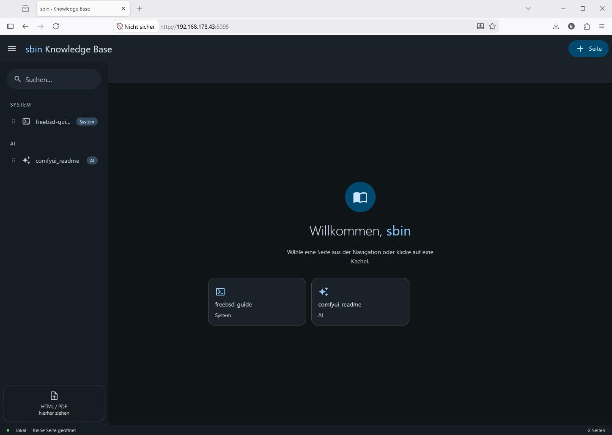

# kbase

Eine selbst gehostete, browserbasierte Knowledge Base für lokale Dokumentationen, Guides und Referenzen.

Läuft als Docker-Container im Heimnetz und ist von allen Geräten im lokalen Netzwerk erreichbar. Dateien wie HTML-Seiten und PDFs können per Drag & Drop hochgeladen, kategorisiert und direkt im Browser geöffnet werden — ohne Cloud, ohne externe Abhängigkeiten.




## Features

- **Drag & Drop Upload** — HTML und PDF direkt in den Browser ziehen
- **Kategorien** — System, Network, Storage, Dev, AI, Sonstiges (erweiterbar)
- **Tab-basierte Ansicht** — mehrere Dokumente gleichzeitig offen
- **Sortierbare Navigation** — Reihenfolge per Drag & Drop anpassen
- **Kontextmenü** — Rechtsklick auf Einträge zum Bearbeiten / Löschen
- **Suche** — Filterung der Navigation in Echtzeit
- **Kein Internet nötig** — alle Assets lokal, keine CDN-Abhängigkeiten

## Stack

| Komponente | Technologie |
|---|---|
| Frontend | HTML/CSS/JS, Material Design 3 Dark, SortableJS |
| Webserver | nginx:alpine |
| API | python:alpine + Flask |
| Deployment | Docker Compose |

## Struktur

```
kbase/
├── api/
│   ├── api.py              # Flask API (/api/pages, /api/upload)
│   └── Dockerfile
├── www/
│   ├── index.html          # komplettes Frontend (Single File)
│   └── docs/               # Platzhalter — Uploads landen in data/docs/
├── data/                   # Laufzeit-Daten (nicht in Git)
│   ├── pages.json          # persistente Seitenliste
│   └── docs/               # hochgeladene HTML/PDF-Dateien
├── docker-compose.yml
├── nginx.conf
└── .gitignore
```

## Voraussetzungen

- Docker + Docker Compose auf dem Zielserver
- Erreichbar im lokalen Netzwerk (oder per Reverse Proxy)

## Setup

```bash
# 1. Repository klonen
git clone https://github.com/ElwinEhlers/kbase.git
cd kbase

# 2. Laufzeit-Verzeichnisse anlegen
mkdir -p data/docs www/docs

# 3. Benutzernamen anpassen (siehe Konfiguration)

# 4. Container starten
docker compose up -d --build
```

Die App ist danach unter `http://<SERVER-IP>:8095` erreichbar.

## Konfiguration

### Benutzername

In `www/index.html` ganz oben im `<script>`-Block:

```js
const USER = 'sbin'; // ← hier den eigenen Benutzernamen eintragen
```

Dieser Name erscheint im Browsertab, in der App-Leiste und auf dem Willkommensbildschirm.

### Port

In `docker-compose.yml`:

```yaml
ports:
  - "8095:80"   # ← linke Seite ändern für anderen Host-Port
```

### Optionaler Reverse Proxy (Nginx Proxy Manager / Traefik)

Den Container hinter einem Reverse Proxy betreiben und per DNS-Name (z.B. über Pi-hole) intern erreichbar machen. Der Container selbst lauscht auf Port 80.

## Nutzung

### Seite hinzufügen
- **Datei hochladen:** HTML oder PDF per Drag & Drop auf die Seite ziehen, oder auf die Drop-Zone in der Navigation klicken
- **Manuell:** Oben rechts auf „+ Seite" klicken und Titel, Pfad und Kategorie eingeben

### Navigation
- Einträge per Drag & Drop an der `⠿`-Markierung umsortieren
- Rechtsklick auf einen Eintrag: Öffnen / Bearbeiten / Tab schließen / Löschen
- Suchfeld oben in der Navigation filtert in Echtzeit

### Dateipfade
Hochgeladene Dateien landen unter `data/docs/` und sind über den Pfad `./docs/<dateiname>` referenzierbar.

## Lizenzen

- [SortableJS](https://github.com/SortableJS/Sortable) — MIT
- [Material Icons](https://github.com/google/material-design-icons) — Apache 2.0
- Eigener Code — MIT
